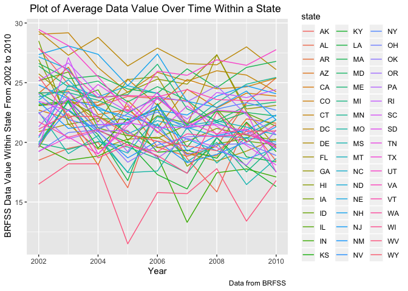
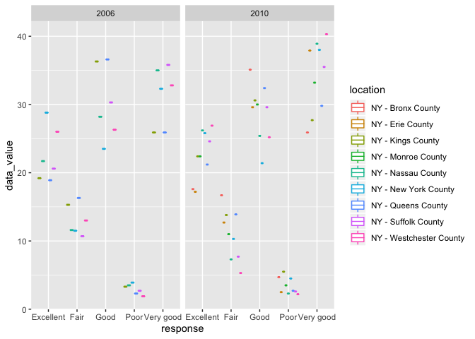
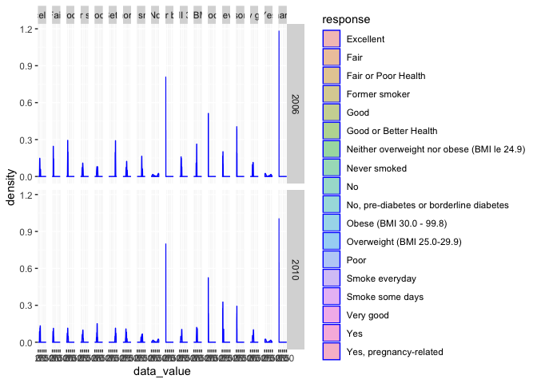

Untitled
================
Keyi Wang
10/7/2019

How many aisles are there, and which aisles are the most items ordered
from?

``` r
## there are 134 different aisles id
instacart %>%
select(aisle_id) %>%
  distinct() %>%
  summarize((n_obs = n())) 
```

    ## # A tibble: 1 x 1
    ##   `(n_obs = n())`
    ##             <int>
    ## 1             134

``` r
## the most popular aisle is aisle 83 which has been ordered 150609 times
instacart %>%
select(aisle_id) %>%
  count(aisle_id) %>%
mutate(
  number_of_aisle = n
) %>%
  arrange(desc(number_of_aisle)) 
```

    ## # A tibble: 134 x 3
    ##    aisle_id      n number_of_aisle
    ##       <int>  <int>           <int>
    ##  1       83 150609          150609
    ##  2       24 150473          150473
    ##  3      123  78493           78493
    ##  4      120  55240           55240
    ##  5       21  41699           41699
    ##  6      115  36617           36617
    ##  7       84  32644           32644
    ##  8      107  31269           31269
    ##  9       91  26240           26240
    ## 10      112  23635           23635
    ## # … with 124 more rows

Make a plot that shows the number of items ordered in each aisle,
limiting this to aisles with more than 10000 items ordered. Arrange
aisles sensibly, and organize your plot so others can read it.

``` r
instacart %>%
select(aisle_id) %>%
  count(aisle_id) %>%
mutate(
   aisle_id = factor(aisle_id),
   number_of_aisle = n
) %>%
  filter(number_of_aisle > 10000) %>%
 ggplot(aes(x = aisle_id, y = number_of_aisle,color = aisle_id )) +
  geom_point() +
  labs(
    title = "Plot of Aisles Ordered More Than 10000 Items",
    x = "Aisle ID",
    y = "Number of Items Ordered"
  ) +
   viridis::scale_color_viridis(
    name = "Aisle ID", 
    discrete = TRUE
  ) +
   theme(legend.position = "bottom")
```

<!-- -->

Make a table showing the three most popular items in each of the aisles
“baking ingredients”, “dog food care”, and “packaged vegetables
fruits”. Include the number of times each item is ordered in your
table.

``` r
##generating dataset for packaged vegetables fruits with top3 items
pvf =
instacart %>%
  filter(aisle == "packaged vegetables fruits" )  %>%
  select(aisle, product_name) %>%
  count(aisle, product_name) %>%
  arrange(desc(n))  %>%
  filter(n > 4059) 

##generating dataset for dog food care with top 3 items
dfc = 
instacart %>%
 filter(aisle == "dog food care")%>%
 select(aisle, product_name) %>%
  count(aisle, product_name) %>%
  arrange(desc(n)) %>%
 filter(n > 25) 

##generating dataset for baking ingredients with top 3 items
bi =
instacart %>%
 filter(aisle == "baking ingredients")%>%
  select(aisle, product_name) %>%
  count(aisle, product_name) %>%
  arrange(desc(n)) %>%
 filter(n > 329)

## combining above dataset to make the desired table
table1 =
bind_rows(pvf,dfc,bi) %>%
knitr::kable()
table1 
```

| aisle                      | product\_name                                 |    n |
| :------------------------- | :-------------------------------------------- | ---: |
| packaged vegetables fruits | Organic Baby Spinach                          | 9784 |
| packaged vegetables fruits | Organic Raspberries                           | 5546 |
| packaged vegetables fruits | Organic Blueberries                           | 4966 |
| dog food care              | Snack Sticks Chicken & Rice Recipe Dog Treats |   30 |
| dog food care              | Organix Chicken & Brown Rice Recipe           |   28 |
| dog food care              | Small Dog Biscuits                            |   26 |
| baking ingredients         | Light Brown Sugar                             |  499 |
| baking ingredients         | Pure Baking Soda                              |  387 |
| baking ingredients         | Cane Sugar                                    |  336 |

Make a table showing the mean hour of the day at which Pink Lady Apples
and Coffee Ice Cream are ordered on each day of the week; format this
table for human readers (i.e. produce a 2 x 7 table).

``` r
instacart %>%
  select(order_dow,order_hour_of_day,product_name,) %>%
 filter(product_name == "Pink Lady Apples"|product_name == "Coffee Ice Cream") %>%
  arrange(order_dow) %>%
  group_by(product_name, order_dow) %>% 
  summarize(mean_hour = mean(order_hour_of_day)) %>% 
  pivot_wider(
    names_from = order_dow,
    values_from = mean_hour
  ) %>%
  rename( Sun = "0" ,
        Mon = "1",
        Tue = "2",
        Wed = "3",
        Thur = "4",
        Fri = "5" ,
        Sat = "6"
        )
```

    ## # A tibble: 2 x 8
    ## # Groups:   product_name [2]
    ##   product_name       Sun   Mon   Tue   Wed  Thur   Fri   Sat
    ##   <chr>            <dbl> <dbl> <dbl> <dbl> <dbl> <dbl> <dbl>
    ## 1 Coffee Ice Cream  13.8  14.3  15.4  15.3  15.2  12.3  13.8
    ## 2 Pink Lady Apples  13.4  11.4  11.7  14.2  11.6  12.8  11.9

format the data to use appropriate variable names; focus on the “Overall
Health” topic include only responses from “Excellent” to “Poor” organize
responses as a factor taking levels ordered from “Poor” to “Excellent”

``` r
## clean and change variable
brfss = 
  brfss_smart2010 %>%
  janitor::clean_names() %>%
  rename( state = "locationabbr",
        location = "locationdesc"
        )
### arrange response data based on topic(Overall Health) from poor to excellent
brfss %>%
  filter(topic == "Overall Health"|response == "Excellent"|response == "Very good"
         |response == "Good"|response == "Fair"|response == "Poor")  %>%
  select(topic,response) %>%
  mutate(
    response = factor(response, levels = c("Poor","Fair","Good","Very good","Excellent"))
  ) %>%
arrange(response)
```

    ## # A tibble: 10,625 x 2
    ##    topic          response
    ##    <chr>          <fct>   
    ##  1 Overall Health Poor    
    ##  2 Overall Health Poor    
    ##  3 Overall Health Poor    
    ##  4 Overall Health Poor    
    ##  5 Overall Health Poor    
    ##  6 Overall Health Poor    
    ##  7 Overall Health Poor    
    ##  8 Overall Health Poor    
    ##  9 Overall Health Poor    
    ## 10 Overall Health Poor    
    ## # … with 10,615 more rows

In 2002, which states were observed at 7 or more locations? What about
in
2010?

``` r
## data manipulation to know which states were observed 7 or more locations in 2002
brfss %>%
filter(year == "2002") %>%
  select(year,state,location) %>%
  group_by(state,location) %>%
  distinct(location) %>%
  arrange(state) %>%
  group_by(state) %>% 
  summarize(n_obs = n()) %>%
  filter(n_obs >= 7)
```

    ## # A tibble: 6 x 2
    ##   state n_obs
    ##   <chr> <int>
    ## 1 CT        7
    ## 2 FL        7
    ## 3 MA        8
    ## 4 NC        7
    ## 5 NJ        8
    ## 6 PA       10

``` r
## data manipulation to know which states were observed 7 or more locations in 2010
brfss %>%
filter(year == "2010") %>%
  select(year,state,location) %>%
  group_by(state,location) %>%
  distinct(location) %>%
  arrange(state) %>%
  group_by(state) %>% 
  summarize(n_obs = n()) %>%
  filter(n_obs >= 7)
```

    ## # A tibble: 14 x 2
    ##    state n_obs
    ##    <chr> <int>
    ##  1 CA       12
    ##  2 CO        7
    ##  3 FL       41
    ##  4 MA        9
    ##  5 MD       12
    ##  6 NC       12
    ##  7 NE       10
    ##  8 NJ       19
    ##  9 NY        9
    ## 10 OH        8
    ## 11 PA        7
    ## 12 SC        7
    ## 13 TX       16
    ## 14 WA       10

Construct a dataset that is limited to Excellent responses, and
contains, year, state, and a variable that averages the data\_value
across locations within a state. Make a “spaghetti” plot of this average
value over time within a state (that is, make a plot showing a line for
each state across years – the geom\_line geometry and group aesthetic
will help).

``` r
brfss %>%
  filter(response == "Excellent")  %>%
  select(year,state,location,data_value) %>%
  drop_na() %>%
  group_by(year,state) %>%
  summarize(ave_within_state_overtime = mean(data_value)) %>%
  ggplot(aes(x = year,y = ave_within_state_overtime,color = state)) +
  geom_line() +
  labs(
    title = " Plot of Average Data Value Over Time Within a State ",
    x = "Year",
    y = " BRFSS Data Value Within State From 2002 to 2010",
    caption = "Data from BRFSS "
  )
```

<!-- -->

Make a two-panel plot showing, for the years 2006, and 2010,
distribution of data\_value for responses (“Poor” to “Excellent”) among
locations in NY State.

``` r
brfss %>%
select (year, state,location,response,data_value)  %>%
filter (response %in% c("Excellent","Very good","Good","Fair","Poor"),
        year %in% c("2006","2010"),state  %in%  c("NY")) %>%
  group_by(location)%>%
 
ggplot(aes(x = response,y = data_value,color = location))+ geom_boxplot()+ facet_grid(~year)
```

<!-- -->

``` r
  brfss %>% 
  filter(year == 2006 | year == 2010) %>% 
  filter(state == "NY") %>%
  group_by(response) %>% 
  ggplot(aes(x = data_value, fill = response)) +
  #geom_density_ridges(scale = .85) #+
  #geom_histogram() +
  geom_density(alpha = .4, adjust = .5, color = "blue") +
  facet_grid(year ~ response)
```

    ## Warning: Removed 52 rows containing non-finite values (stat_density).

<!-- -->
