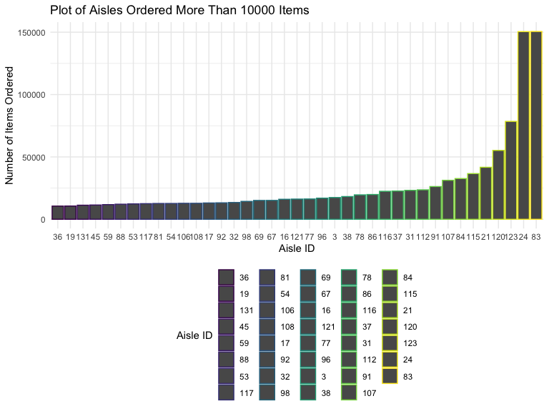

Untitled
================
Keyi Wang
10/7/2019

How many aisles are there, and which aisles are the most items ordered
from?

``` r
## there are 134 different aisles id
instacart %>%
select(aisle_id) %>%
  distinct() %>%
  summarize((n_obs = n())) 
```

    ## # A tibble: 1 x 1
    ##   `(n_obs = n())`
    ##             <int>
    ## 1             134

``` r
## the most popular aisle is aisle 83 which has been ordered 150609 times
instacart %>%
select(aisle_id) %>%
  count(aisle_id) %>%
mutate(
  number_of_aisle = n
) %>%
  arrange(desc(number_of_aisle)) 
```

    ## # A tibble: 134 x 3
    ##    aisle_id      n number_of_aisle
    ##       <int>  <int>           <int>
    ##  1       83 150609          150609
    ##  2       24 150473          150473
    ##  3      123  78493           78493
    ##  4      120  55240           55240
    ##  5       21  41699           41699
    ##  6      115  36617           36617
    ##  7       84  32644           32644
    ##  8      107  31269           31269
    ##  9       91  26240           26240
    ## 10      112  23635           23635
    ## # … with 124 more rows

Make a plot that shows the number of items ordered in each aisle,
limiting this to aisles with more than 10000 items ordered. Arrange
aisles sensibly, and organize your plot so others can read it.

``` r
instacart %>%
select(aisle_id) %>%
  count(aisle_id) %>%
mutate(
   aisle_id = factor(aisle_id),
   number_of_aisle = n
) %>%
  filter(number_of_aisle > 10000) %>%
 ggplot(aes(x = aisle_id, y = number_of_aisle,color = aisle_id )) +
  geom_point() +
  labs(
    title = "Plot of Aisles Ordered More Than 10000 Items",
    x = "Aisle ID",
    y = "Number of Items Ordered"
  ) +
   viridis::scale_color_viridis(
    name = "Aisle ID", 
    discrete = TRUE
  ) +
   theme(legend.position = "bottom")
```

<!-- -->
Make a table showing the three most popular items in each of the aisles
“baking ingredients”, “dog food care”, and “packaged vegetables
fruits”. Include the number of times each item is ordered in your
table.

``` r
##generating dataset for packaged vegetables fruits with top3 items
pvf =
instacart %>%
  filter(aisle == "packaged vegetables fruits" )  %>%
  select(aisle, product_name) %>%
  count(aisle, product_name) %>%
  arrange(desc(n))  %>%
  filter(n > 4059) 

##generating dataset for dog food care with top 3 items
dfc = 
instacart %>%
 filter(aisle == "dog food care")%>%
 select(aisle, product_name) %>%
  count(aisle, product_name) %>%
  arrange(desc(n)) %>%
 filter(n > 25) 

##generating dataset for baking ingredients with top 3 items
bi =
instacart %>%
 filter(aisle == "baking ingredients")%>%
  select(aisle, product_name) %>%
  count(aisle, product_name) %>%
  arrange(desc(n)) %>%
 filter(n > 329)

table1 =
bind_rows(pvf,dfc,bi) %>%
knitr::kable()
table1 
```

| aisle                      | product\_name                                 |    n |
| :------------------------- | :-------------------------------------------- | ---: |
| packaged vegetables fruits | Organic Baby Spinach                          | 9784 |
| packaged vegetables fruits | Organic Raspberries                           | 5546 |
| packaged vegetables fruits | Organic Blueberries                           | 4966 |
| dog food care              | Snack Sticks Chicken & Rice Recipe Dog Treats |   30 |
| dog food care              | Organix Chicken & Brown Rice Recipe           |   28 |
| dog food care              | Small Dog Biscuits                            |   26 |
| baking ingredients         | Light Brown Sugar                             |  499 |
| baking ingredients         | Pure Baking Soda                              |  387 |
| baking ingredients         | Cane Sugar                                    |  336 |
