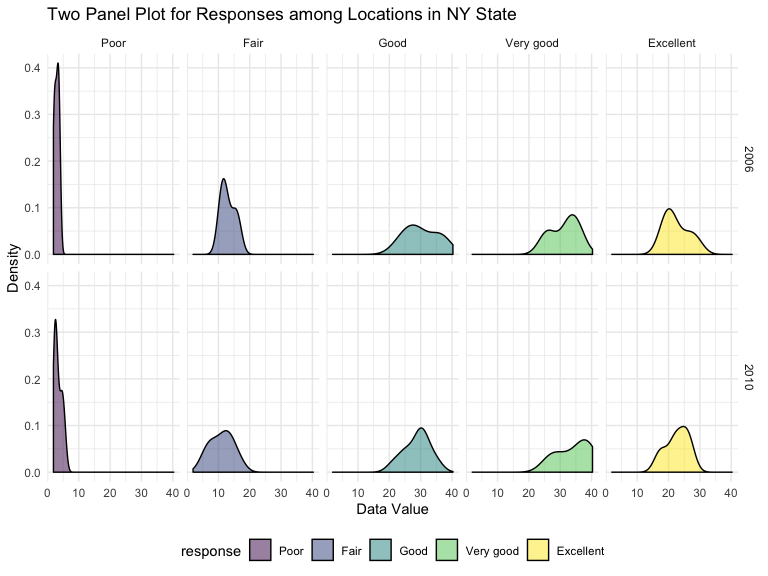

Untitled
================
Keyi Wang
10/7/2019

How many aisles are there, and which aisles are the most items ordered
from?

``` r
## there are 134 different aisles id
instacart %>%
select(aisle_id) %>%
  distinct() %>%
  summarize((n_obs = n())) 
```

    ## # A tibble: 1 x 1
    ##   `(n_obs = n())`
    ##             <int>
    ## 1             134

``` r
## the most popular aisle is aisle 83 which has been ordered 150609 times
instacart %>%
  group_by(aisle) %>%
  count(aisle_id) %>%
mutate(
  number_of_item = n
) %>%
  select(-n)%>%
  arrange(desc(number_of_item)) 
```

    ## # A tibble: 134 x 3
    ## # Groups:   aisle [134]
    ##    aisle                         aisle_id number_of_item
    ##    <chr>                            <int>          <int>
    ##  1 fresh vegetables                    83         150609
    ##  2 fresh fruits                        24         150473
    ##  3 packaged vegetables fruits         123          78493
    ##  4 yogurt                             120          55240
    ##  5 packaged cheese                     21          41699
    ##  6 water seltzer sparkling water      115          36617
    ##  7 milk                                84          32644
    ##  8 chips pretzels                     107          31269
    ##  9 soy lactosefree                     91          26240
    ## 10 bread                              112          23635
    ## # … with 124 more rows

Make a plot that shows the number of items ordered in each aisle,
limiting this to aisles with more than 10000 items ordered. Arrange
aisles sensibly, and organize your plot so others can read it.

``` r
##plot showing the number of items ordered in ecah aisle from 
## the least popular to most popular aisles
cart_1 = instacart %>%
select(aisle_id) %>%
  count(aisle_id) %>%
mutate(
  number_of_item = n
) %>%
  arrange(desc(number_of_item)) 

cart_1 %>%
  filter(number_of_item > 10000) %>%
  mutate(
   aisle_id = factor(aisle_id),
  aisle_id = forcats::fct_reorder(aisle_id, number_of_item )) %>%
  ggplot(aes(x = aisle_id, y = number_of_item,color = aisle_id))+
  geom_col() +
  labs(
    title = "Plot of Aisles Ordered More Than 10000 Items",
    x = "Aisle ID",
    y = "Number of Items Ordered"
  ) +
   viridis::scale_color_viridis(
    name = "Aisle ID", 
    discrete = TRUE
  ) +
   theme(legend.position = "bottom")
```


Make a table showing the three most popular items in each of the aisles
“baking ingredients”, “dog food care”, and “packaged vegetables
fruits”. Include the number of times each item is ordered in your
table.

``` r
item_table = instacart %>% 
  group_by(aisle, product_name) %>% 
  filter(aisle == "baking ingredients" | aisle == "dog food care" |  aisle == "packaged vegetables fruits") %>% 
  summarize(number_sale = n()) %>% 
  filter(min_rank(desc(number_sale)) < 4) %>% 
  arrange(desc(number_sale)) %>% 
  knitr::kable()
item_table
```

| aisle                      | product\_name                                 | number\_sale |
| :------------------------- | :-------------------------------------------- | -----------: |
| packaged vegetables fruits | Organic Baby Spinach                          |         9784 |
| packaged vegetables fruits | Organic Raspberries                           |         5546 |
| packaged vegetables fruits | Organic Blueberries                           |         4966 |
| baking ingredients         | Light Brown Sugar                             |          499 |
| baking ingredients         | Pure Baking Soda                              |          387 |
| baking ingredients         | Cane Sugar                                    |          336 |
| dog food care              | Snack Sticks Chicken & Rice Recipe Dog Treats |           30 |
| dog food care              | Organix Chicken & Brown Rice Recipe           |           28 |
| dog food care              | Small Dog Biscuits                            |           26 |

Make a table showing the mean hour of the day at which Pink Lady Apples
and Coffee Ice Cream are ordered on each day of the week; format this
table for human readers (i.e. produce a 2 x 7 table).

``` r
instacart %>%
  select(order_dow,order_hour_of_day,product_name,) %>%
 filter(product_name == "Pink Lady Apples"|product_name == "Coffee Ice Cream") %>%
  arrange(order_dow) %>%
  group_by(product_name, order_dow) %>% 
  summarize(mean_hour = mean(order_hour_of_day)) %>% 
  pivot_wider(
    names_from = order_dow,
    values_from = mean_hour
  ) %>%
  rename( Sun = "0" ,
        Mon = "1",
        Tue = "2",
        Wed = "3",
        Thur = "4",
        Fri = "5" ,
        Sat = "6"
        )%>%
knitr::kable(digit = 1)
```

| product\_name    |  Sun |  Mon |  Tue |  Wed | Thur |  Fri |  Sat |
| :--------------- | ---: | ---: | ---: | ---: | ---: | ---: | ---: |
| Coffee Ice Cream | 13.8 | 14.3 | 15.4 | 15.3 | 15.2 | 12.3 | 13.8 |
| Pink Lady Apples | 13.4 | 11.4 | 11.7 | 14.2 | 11.6 | 12.8 | 11.9 |

Short description of the dataset: This dataset contains information
about online grocery orders from more than 200,000 Instacart users and
there are 1384617 observations of 131209 customers in the year of 2017,
where each row in the dataset is a product from an order. There are
total 15 variables: \* order\_id: order identifier \* product\_id:
product identifier \* add\_to\_cart\_order: order in which each product
was added to cart \* reordered: 1 if this prodcut has been ordered by
this user in the past, 0 otherwise \* user\_id: customer identifier \*
eval\_set: which evaluation set this order belongs in (Note that the
data for use in this class is exclusively from the “train” eval\_set) \*
order\_number: the order sequence number for this user (1=first, n=nth)
\* order\_dow: the day of the week on which the order was placed \*
order\_hour\_of\_day: the hour of the day on which the order was placed
\* days\_since\_prior\_order: days since the last order, capped at 30,
NA if order\_number=1 \* product\_name: name of the product \*
aisle\_id: aisle identifier \* department\_id: department identifier \*
aisle: the name of the aisle \* department: the name of the department

While doing data manipulation, I found the item\_table I made most
useful as We can find the most popular product within each aisle.
Perhaps, we can use this data to prepare the inventory and keep on track
of how many inventory the store should have on hand to sale. And if we
combine this with time of order or date of order, we can maybe find a
pattern for certain products and their best selling dates, (for example,
turkey and thanksgiving day) to properly prepare our inventory in case
that some certain goods would be out-of-stock on certain period of time
and having excessive inventory for other times.

\#\#problem2

format the data to use appropriate variable names; focus on the “Overall
Health” topic include only responses from “Excellent” to “Poor” organize
responses as a factor taking levels ordered from “Poor” to “Excellent”

``` r
## clean and change variable
brfss = 
  brfss_smart2010 %>%
  janitor::clean_names() %>%
  rename( state = "locationabbr",
        location = "locationdesc"
        )
### arrange response data based on topic(Overall Health) from poor to excellent
 brfss %>%
  filter(topic == "Overall Health"|response == "Excellent"|response == "Very good"
         |response == "Good"|response == "Fair"|response == "Poor")  %>%
  select(topic,response) %>%
  mutate(
    response = factor(response, levels = c("Poor","Fair","Good","Very good","Excellent"))
  ) %>%
arrange(response)
```

    ## # A tibble: 10,625 x 2
    ##    topic          response
    ##    <chr>          <fct>   
    ##  1 Overall Health Poor    
    ##  2 Overall Health Poor    
    ##  3 Overall Health Poor    
    ##  4 Overall Health Poor    
    ##  5 Overall Health Poor    
    ##  6 Overall Health Poor    
    ##  7 Overall Health Poor    
    ##  8 Overall Health Poor    
    ##  9 Overall Health Poor    
    ## 10 Overall Health Poor    
    ## # … with 10,615 more rows

In 2002, which states were observed at 7 or more locations? What about
in
2010?

``` r
## data manipulation to know which states were observed 7 or more locations in 2002
brfss %>%
filter(year == "2002") %>%
  select(year,state,location) %>%
  group_by(state,location) %>%
  distinct(location) %>%
  arrange(state) %>%
  group_by(state) %>% 
  summarize(n_obs = n()) %>%
  filter(n_obs >= 7)
```

    ## # A tibble: 6 x 2
    ##   state n_obs
    ##   <chr> <int>
    ## 1 CT        7
    ## 2 FL        7
    ## 3 MA        8
    ## 4 NC        7
    ## 5 NJ        8
    ## 6 PA       10

``` r
## data manipulation to know which states were observed 7 or more locations in 2010
brfss %>%
filter(year == "2010") %>%
  select(year,state,location) %>%
  group_by(state,location) %>%
  distinct(location) %>%
  arrange(state) %>%
  group_by(state) %>% 
  summarize(n_obs = n()) %>%
  filter(n_obs >= 7)
```

    ## # A tibble: 14 x 2
    ##    state n_obs
    ##    <chr> <int>
    ##  1 CA       12
    ##  2 CO        7
    ##  3 FL       41
    ##  4 MA        9
    ##  5 MD       12
    ##  6 NC       12
    ##  7 NE       10
    ##  8 NJ       19
    ##  9 NY        9
    ## 10 OH        8
    ## 11 PA        7
    ## 12 SC        7
    ## 13 TX       16
    ## 14 WA       10

Aswer to above questions: In 2002, the states that were observed at 7 or
more locations are Connecticut, Florida, Massachusetts, North Carolina,
New Jersey, Pennsylvania. In 2010, the states that were observed at 7 or
more locations are California, Colorado, Florida, Massachusetts,
Maryland, North Carolina, Nebraska, New Jersey, New York, Ohio,
Pannsylvania, South Carolina, Texas, Washington.

Construct a dataset that is limited to Excellent responses, and
contains, year, state, and a variable that averages the data\_value
across locations within a state. Make a “spaghetti” plot of this average
value over time within a state (that is, make a plot showing a line for
each state across years – the geom\_line geometry and group aesthetic
will help).

``` r
brfss %>%
  filter(response == "Excellent")  %>%
  select(year,state,location,data_value) %>%
  drop_na() %>%
  group_by(year,state) %>%
  summarize(ave_within_state_overtime = mean(data_value)) %>%
  ggplot(aes(x = year,y = ave_within_state_overtime,color = state)) +
  geom_line() +
  labs(
    title = " Plot of Average Data Value Over Time Within a State ",
    x = "Year",
    y = " BRFSS Data Value From 2002 to 2010",
    caption = "Data from BRFSS "
  )
```


The average data value for each state across its locations(counties)
from 2002 to 2010 is relatively stable (which means there is no big
change/jump through this period of time).

Make a two-panel plot showing, for the years 2006, and 2010,
distribution of data\_value for responses (“Poor” to “Excellent”) among
locations in NY State.

``` r
  brfss %>%
  filter(topic == "Overall Health"|response == "Excellent"|response == "Very good"
         |response == "Good"|response == "Fair"|response == "Poor")  %>%
   mutate(
    response = factor(response, levels = c("Poor","Fair","Good","Very good","Excellent"))
  ) %>%
arrange(response)%>%
  filter(year == "2006" | year == "2010") %>% 
  filter(state == "NY") %>% 
  group_by(response) %>%  
  ggplot(aes(x = data_value, fill = response)) +
  geom_density(alpha = 0.5) +
  facet_grid(year ~ response) +
  labs(
    title = "Two Panel Plot for Responses among Locations in NY State",
    x = "Data Value",
    y = "Density"
  )
```


Within the state of NY, the distributions of each response given the
same response is mostly similar between the year of 2006 and 2010. The
Fair response differed a little, but it is not terribly different.

Load, tidy, and otherwise wrangle the data. Your final dataset should
include all originally observed variables and values; have useful
variable names; include a weekday vs weekend variable; and encode data
with reasonable variable classes. Describe the resulting dataset
(e.g. what variables exist, how many observations, etc).

``` r
accel_data = read_csv(file = "./data/accel_data.csv")
```

    ## Parsed with column specification:
    ## cols(
    ##   .default = col_double(),
    ##   day = col_character()
    ## )

    ## See spec(...) for full column specifications.

``` r
tidy_accel_data = 
accel_data %>%
janitor::clean_names() %>%
pivot_longer(
  activity_1:activity_1440,
  names_to = "nth_minute", 
  names_prefix = "activity_",
  values_to = "activity" 
  ) %>% 
  mutate(
    week = as.factor(week),
    nth_minute = as.numeric(nth_minute),
    day_id = as.integer(day_id),
    day = forcats::fct_relevel(day,c("Monday","Tuesday","Wednesday","Thursday","Friday","Saturday","Sunday"))) %>% 
    arrange(day) %>% 
    mutate(weekday_weekend = case_when(
    day %in% c("Monday","Tuesday","Wednesday","Thursday","Friday")~ "weekday",
    day %in% c("Saturday","Sunday")~ "weekend",
    TRUE     ~ ""
  )) 
```

Traditional analyses of accelerometer data focus on the total activity
over the day. Using your tidied dataset, aggregate accross minutes to
create a total activity variable for each day, and create a table
showing these totals. Are any trends apparent?

``` r
tidy_accel_data %>%
  group_by(week, day,weekday_weekend) %>%
  summarize(
    total_activity = sum(activity)
  ) %>% 
 knitr::kable()
```

| week | day       | weekday\_weekend | total\_activity |
| :--- | :-------- | :--------------- | --------------: |
| 1    | Monday    | weekday          |        78828.07 |
| 1    | Tuesday   | weekday          |       307094.24 |
| 1    | Wednesday | weekday          |       340115.01 |
| 1    | Thursday  | weekday          |       355923.64 |
| 1    | Friday    | weekday          |       480542.62 |
| 1    | Saturday  | weekend          |       376254.00 |
| 1    | Sunday    | weekend          |       631105.00 |
| 2    | Monday    | weekday          |       295431.00 |
| 2    | Tuesday   | weekday          |       423245.00 |
| 2    | Wednesday | weekday          |       440962.00 |
| 2    | Thursday  | weekday          |       474048.00 |
| 2    | Friday    | weekday          |       568839.00 |
| 2    | Saturday  | weekend          |       607175.00 |
| 2    | Sunday    | weekend          |       422018.00 |
| 3    | Monday    | weekday          |       685910.00 |
| 3    | Tuesday   | weekday          |       381507.00 |
| 3    | Wednesday | weekday          |       468869.00 |
| 3    | Thursday  | weekday          |       371230.00 |
| 3    | Friday    | weekday          |       467420.00 |
| 3    | Saturday  | weekend          |       382928.00 |
| 3    | Sunday    | weekend          |       467052.00 |
| 4    | Monday    | weekday          |       409450.00 |
| 4    | Tuesday   | weekday          |       319568.00 |
| 4    | Wednesday | weekday          |       434460.00 |
| 4    | Thursday  | weekday          |       340291.00 |
| 4    | Friday    | weekday          |       154049.00 |
| 4    | Saturday  | weekend          |         1440.00 |
| 4    | Sunday    | weekend          |       260617.00 |
| 5    | Monday    | weekday          |       389080.00 |
| 5    | Tuesday   | weekday          |       367824.00 |
| 5    | Wednesday | weekday          |       445366.00 |
| 5    | Thursday  | weekday          |       549658.00 |
| 5    | Friday    | weekday          |       620860.00 |
| 5    | Saturday  | weekend          |         1440.00 |
| 5    | Sunday    | weekend          |       138421.00 |

``` r
### since it is not very easy for us to find an exact trend in a 
### table, I decided to it into a plot.
  table_data =
  tidy_accel_data %>%
  group_by(week, day) %>%
  summarize(
    sum_of_day = sum(activity)
  )  %>%
    ungroup(week,day)%>%
    mutate(
      day_number  =  row_number()
    )
  
table_data %>%
  ggplot(aes(x = day_number, y = sum_of_day)) +
  geom_point(aes(color = day_number), alpha = 0.5) +
  geom_line(aes(color = day_number)) +
  labs(
    title = "Trend Plot for Activity Across 35 days ",
    x = "Days",
    y = "Total Activity Counts for Each Day",
    caption = "Data from the Advanced Cardiac Care Center of Columbia University Medical Center"
  ) +
  scale_y_continuous(
    breaks = c(0, 200000, 400000, 600000, 800000),
    labels = c("0", "200000", "400000", "600000", "800000")
    )
```


This dataset is called accel\_data which uses five weeks of
accelerometer data collected on a 63 year-old male with BMI 25, who was
admitted to the Advanced Cardiac Care Center of Columbia University
Medical Center and diagnosed with congestive heart failure (CHF).

The variables are:

  - week: the number of the week of this man’s data record
  - day\_id: the number of the day of this man’s data record
  - day: the day of week of this man’s data record
  - minute\_in\_a\_day: the minute of a day of this man’s data record
  - activity\_count: the activity counts for each minute of a 24-hour
    day starting at midnight for this man’s data record
  - weekday: to indicate whether it is a weekday or a weekend for this
    man’s data record

Accelerometer data allows the inspection activity over the course of the
day. Make a single-panel plot that shows the 24-hour activity time
courses for each day and use color to indicate day of the week. Describe
in words any patterns or conclusions you can make based on this graph.

``` r
tidy_accel_data %>% 
  group_by(day) %>% 
  mutate(
  hour_per_day = ceiling(nth_minute/60)) %>% 
  ## sum up one-hour activity
  group_by(day_id,day, hour_per_day) %>% 
  summarize(sum_by_hour = sum(activity)) %>% 
  ggplot(aes(x = hour_per_day, y = sum_by_hour)) +
  geom_point(aes(color = day)) +
  geom_line(aes(color = day)) +
  labs(
    title = "Plot for 24-hour Activity Time Courses for Each Day",
    x = "Hour in a Day",
    y = "Total Activity for Each Hour"
    ) +
    scale_y_continuous(
    breaks = c(0, 100000, 200000, 300000),
    labels = c("0", "100000", "200000", "300000")
  )+
    scale_x_continuous(
    breaks = c(0, 4, 8, 12, 16, 20, 24),
    labels = c("0", "4", "8", "12", "16", "20", "24"))
```


By summing up the each one- hour actvity, I create a plot showing the
trend of activity within 35 days based on 24-hour time course. According
to the plot above, we can see that the man is inactive during 0AM - 8AM,
and then maintained a stable level of activeness for the rest of day
from 8AM to 8PM. However, he moved around a lot at Friday nights and
Sunday mornings relatively. Then his activity counts gradually decreased
after 8PM.
